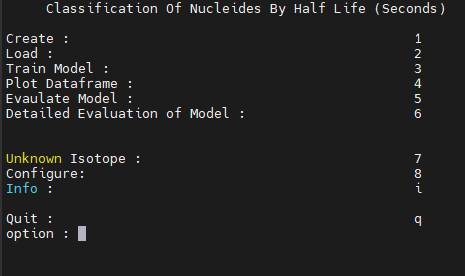
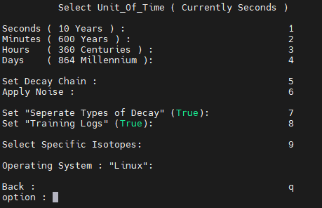
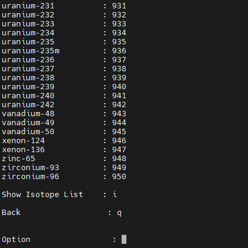
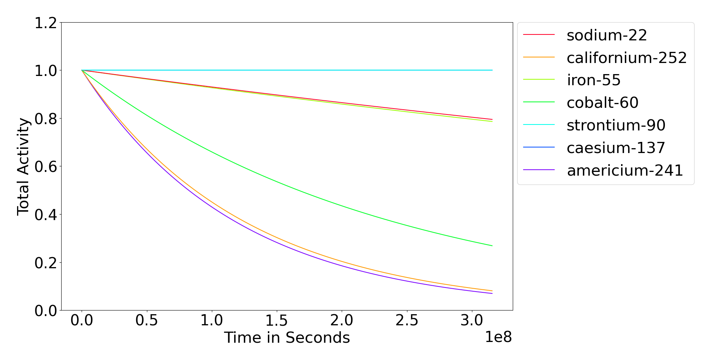
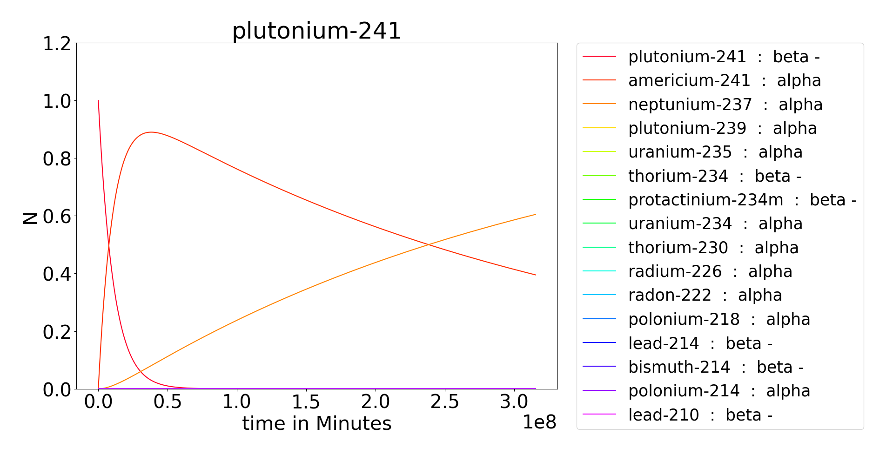
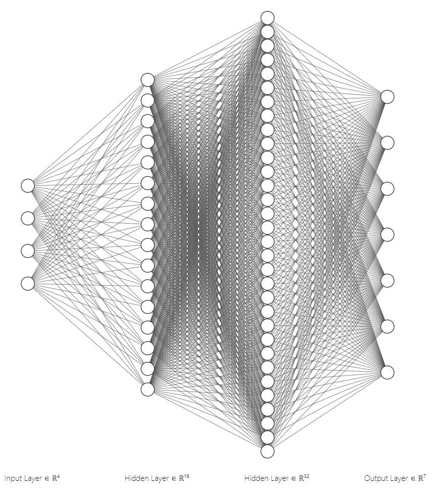
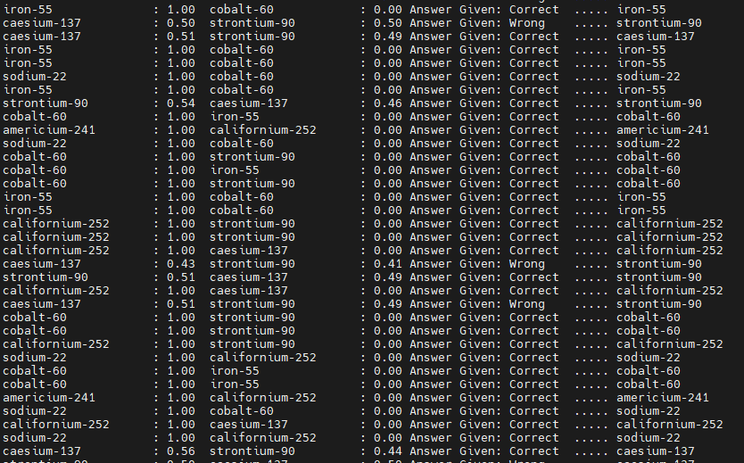
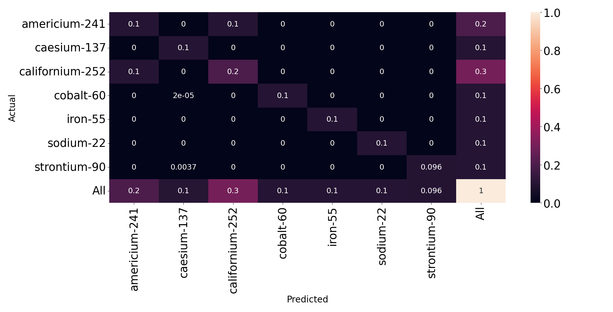

# MLRI - test directory

This directory has been created to allow for testing of the code
developed for this repository.  None of the functionality for the project
should be stored in files in this directory.

----------------------------
Project Authors:
Adrian Bevan, Jordan Ellis
Queen Mary, University of London
For more information contact a.j.bevan@qmul.ac.uk


## Required Libaries 

```console
$ pip install tensorflow
$ pip install matplotlib
$ pip install numpy
$ pip install pandas
$ pip install seaborn
$ pip install sklearn
```

## User Interface



All the menus for the user interface is displayed in this format allowing 
easy navigation between different task.
 


Menu where all preferences for how the simulated data can be selected.
 

 
Segment of all the isotopes that can be selected to train models on.

## Plotting
All graphs are made using matplotlib.



The graph above shows a time series for the activity of 7 selected radioisotopes that may be found in a lab environment over 10 years.
 


Plot for the activity of Plutonium-241 and all of the radioisotopes in the decay chain over 600 years.

## Training Models

Models have two hidden layers 16 layers and 32 layers and the output layers is decided by the number of radioisotopes selected.



## Evaluating Models
Evaluating models provides the accuracy and insight into how the program
 


Predictions and probabilities for radioisotopes made by a trained model. ( Only displaying the two radioisotopes with the highest probabilities) 
 


A confusion matrices can be displayed for each trained model.
 
